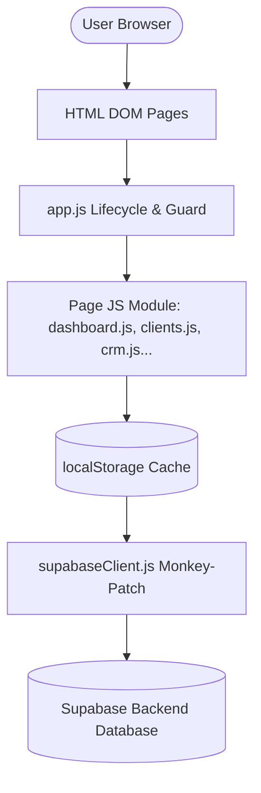

# 02_ARCHITECTURE.md — System Architecture & Design

This document details the architectural patterns, data synchronization mechanisms, and code structure of **Agency365**.

---

## 1. Architectural Philosophy
Agency365 is designed as a **decentralized, offline-first client-side web application** that utilizes a remote backend (Supabase) as its centralized source of truth.

### Key Tenets:
- **Zero Framework Footprint:** Built on native ES6 Javascript Modules and Vanilla CSS. No compile/build step is required for local development.
- **Offline-First Resilience:** Data is written to `localStorage` first. Mutations automatically trigger asynchronous sync operations to Supabase. This guarantees that UI rendering is instantaneous and network drops do not block operational workflows.
- **Dynamic Imports:** Supabase SDK is loaded dynamically on boot, ensuring that failure to reach the CDN does not crash the local application layer.

---

## 2. Global Component Mapping

### Component Responsibilities:
- **`app.js`**: Orchestrates application boot, manages user authentication, global session guards, custom dialog modules (window.customConfirm, window.customPrompt), keyboard shortcuts, notifications, and pull-to-refresh.
- **`supabaseClient.js`**: Configures the Supabase client wrapper, handles user login/signup database calls, dynamically intercepts all `localStorage.setItem` calls, and pushes updates asynchronously.
- **`styles.css` & `mobile-overrides.css`**: Define the design system tokens, typography scales, light/dark themes, desktop layouts, and responsive tablet/mobile overrides.

---

## 3. Data Synchronization Strategy

### A. Read Operations (Bootstrap)
On application load, `app.js` triggers `syncFromSupabase()`.
1. The user's active session is verified via `supabase.auth.getUser()`.
2. Asynchronous parallel requests fetch data from the tables: `clients`, `proposals`, `expenses`, and `events`.
3. The returned datasets overwrite local keys (`agency365_clients`, etc.) in `localStorage` using the underlying original `setItem` function to prevent trigger recursion.

### B. Write Operations (Upsert Strategy)
To maintain simplicity and prevent sync conflicts:
1. When page Javascript mutates data (e.g. adding a meeting inside clients array), it updates its in-memory array and calls `localStorage.setItem('agency365_clients', JSON.stringify(clients))`.
2. The monkey-patched `setItem` intercepts this call.
3. An asynchronous deletion removes all remote rows matching the current `user_id`.
4. The entire locally mutated array is mapped to new rows containing `{ user_id, data: itemObject }` and bulk-inserted into Supabase.

---

## 4. Key Architectural Restrictions
- **No Shared State Across Modules:** Modules must load state directly from the centralized `localStorage` keys or session caches during initialization.
- **No UI-Blocking API Requests:** Network database writes must always run in the background. The interface must transition states instantly based on successful local cache mutations.
