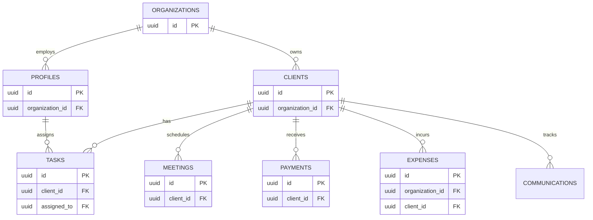

# Database Relationships & ERD

Agency365 relies on a strict relational model to ensure data integrity. The core of this system is multi-tenancy, enforced by the `organizations` table.

## Entity Relationship Diagram

## Relationship Rules

1. **One-To-Many (Organization to Clients/Profiles):** 
   Every client and every profile MUST belong to an organization. `organization_id` cannot be null on these tables.
2. **One-To-Many (Client to Data):**
   Tasks, Payments, and Meetings MUST belong to a specific client.
3. **Polymorphic / Nullable Foreign Keys (Expenses):**
   The `expenses` table must track which organization incurred the expense. However, it can optionally be tied to a specific project. Therefore, `expenses.organization_id` is NOT NULL, but `expenses.client_id` IS NULLABLE.
